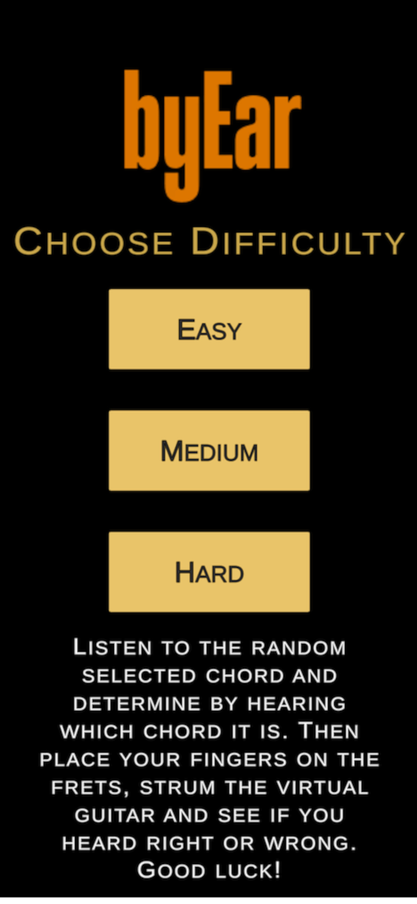
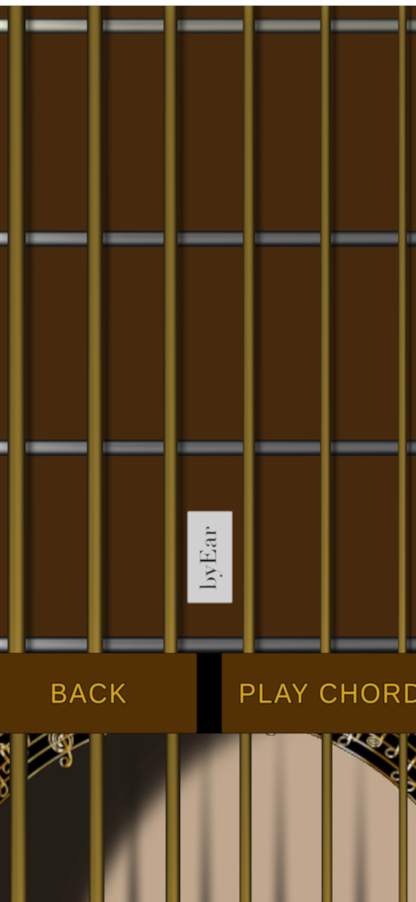
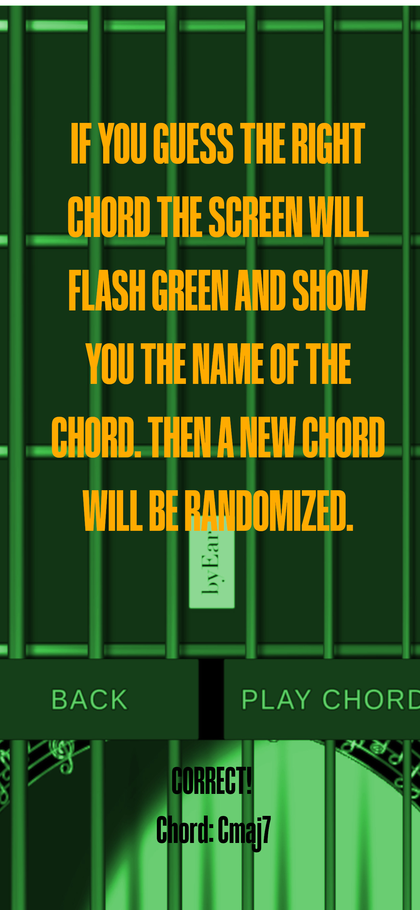

# byear-app

  
  <h1>
    byEar  <emph>Listen & Play the Chord</emph>
  </h1>
    
  <b>Developer: azullstrom</b>

  

  Are you an experienced musician, a novice guitarist, or just curious about developing your musical ear? Then this is the perfect app for you!
  
  The app features a virtual guitar that you play just like you would play a real guitar. When you start the app, you can choose the difficulty level, which determines how challenging the guitar chords will be to figure out by ear.
  

  
  
  
  

